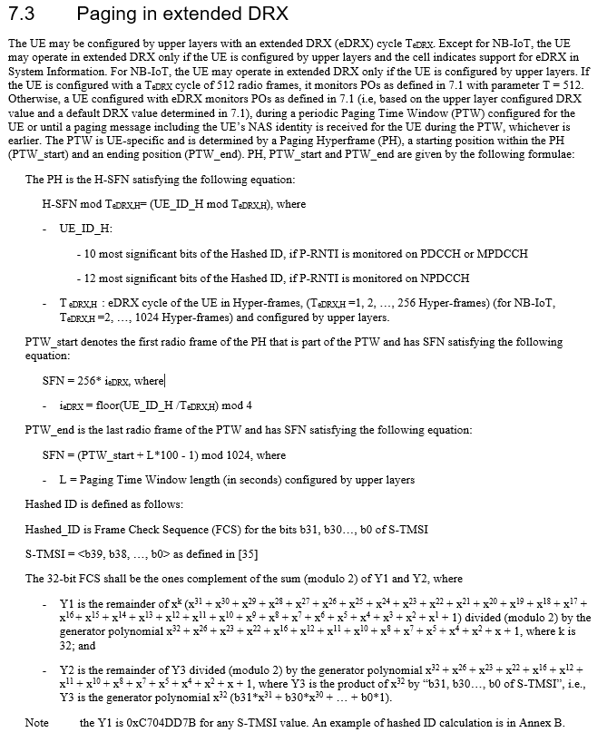

# NB-IoT paging in extendedDRX

This tool is used to calculate NB-IoT paging times in extendedDRX from S-TMSI, Tedrx and PTW.

Specification 3GPP 36.304 describes the procedure that is implemented in this simple tool.

<p align="center"></p>


The inputs are:

- S-TMSI (only last 32 bits are needed)
- Tedrx (cycle in Hyper-Frames (1,2,4,8, ..., 1024)
- PTW in seconds
- Time reference (current time, or the specfied time in CLI)
- Channel Type (PDCCH, MPDCCH or NPDCCH (NPDCCH by default))

The outputs:

- UE_ID_H (12 bits for NB-IoT)
- Paging Hyperframe (PH)
- PTW_start
- PTW_end

- Last H-SFN 0
- Last H-SFN for given Tedrx
- Next 20 PH H-SFN timestamps (UTC) for specified S-TMSI

CLI Options:

```
# python hsn.py -h
Usage: hsn.py [options]

Options:
  -h, --help            show this help message and exit
  -s STMSI, --stmsi=STMSI
                        S-TMSI in hex digits (full or last 32 bits)
  -t TEDRX, --tedrx=TEDRX
                        Tedrx value in Hyper-Frames (2-1024)
  -p PTW, --ptw=PTW     PTW in seconds
  -U, --reference       UTC time reference (1972/06/30 00:00:00). Default is
                        GPS (1980/01/06 00:00:00)
  -D DATE, --date=DATE  Specify start date. Default is to use current time.
  -C CHANNEL, --channel=CHANNEL
                        Channel  (PDCCH (for LTE), MPDCCH (for LTE-M) or
                        NPDCCH (for NB-IoT)). Default is NPDCCH (NB-IoT)

```


Example usage:

```
# python hsn.py -s EB00E01E -t 16 -p 2.56 -D "2021-04-30 11:20:00"

Last H-SFN 0: 2021-04-30 09:24:26.160000
Last possible H-SFN start for given Tedrx: 2021-04-30 11:19:07.440000

UE_ID_H: 2808
First H-SPN for PH: 8
PTW_Start: 768
PTW_End 1023

Possible paging times (UTC) :

        -> H-SFN: 680    (1010101000)   date: 2021-04-30 11:20:37.040000
        -> H-SFN: 696    (1010111000)   date: 2021-04-30 11:23:20.880000
        -> H-SFN: 712    (1011001000)   date: 2021-04-30 11:26:04.720000
        -> H-SFN: 728    (1011011000)   date: 2021-04-30 11:28:48.560000
        -> H-SFN: 744    (1011101000)   date: 2021-04-30 11:31:32.400000
        -> H-SFN: 760    (1011111000)   date: 2021-04-30 11:34:16.240000
        -> H-SFN: 776    (1100001000)   date: 2021-04-30 11:37:00.080000
        -> H-SFN: 792    (1100011000)   date: 2021-04-30 11:39:43.920000
        -> H-SFN: 808    (1100101000)   date: 2021-04-30 11:42:27.760000
        -> H-SFN: 824    (1100111000)   date: 2021-04-30 11:45:11.600000
        -> H-SFN: 840    (1101001000)   date: 2021-04-30 11:47:55.440000
        -> H-SFN: 856    (1101011000)   date: 2021-04-30 11:50:39.280000
        -> H-SFN: 872    (1101101000)   date: 2021-04-30 11:53:23.120000
        -> H-SFN: 888    (1101111000)   date: 2021-04-30 11:56:06.960000
        -> H-SFN: 904    (1110001000)   date: 2021-04-30 11:58:50.800000
        -> H-SFN: 920    (1110011000)   date: 2021-04-30 12:01:34.640000
        -> H-SFN: 936    (1110101000)   date: 2021-04-30 12:04:18.480000
        -> H-SFN: 952    (1110111000)   date: 2021-04-30 12:07:02.320000
        -> H-SFN: 968    (1111001000)   date: 2021-04-30 12:09:46.160000
        -> H-SFN: 984    (1111011000)   date: 2021-04-30 12:12:30


```

